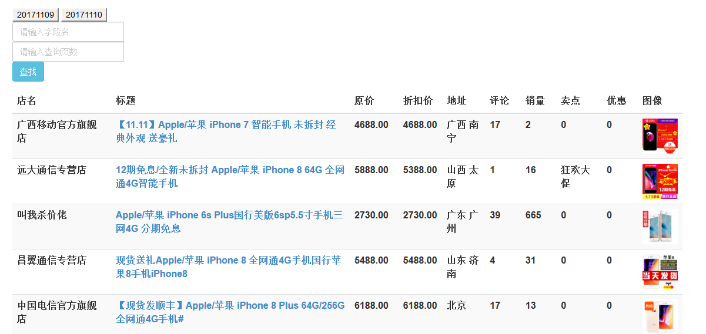
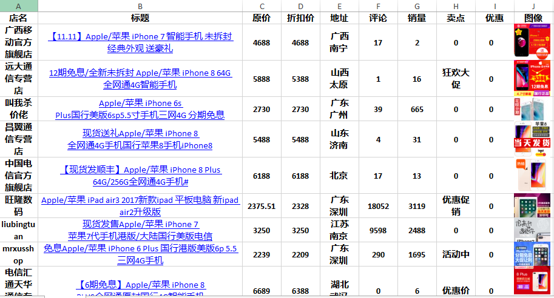
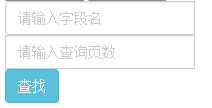
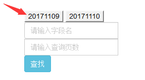
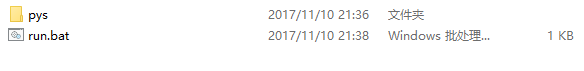
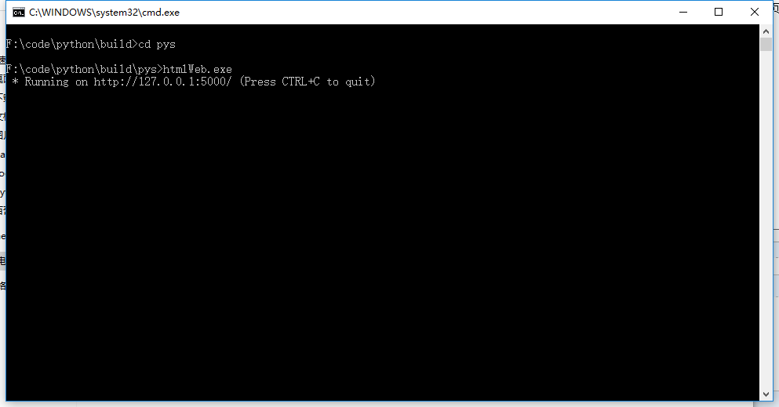
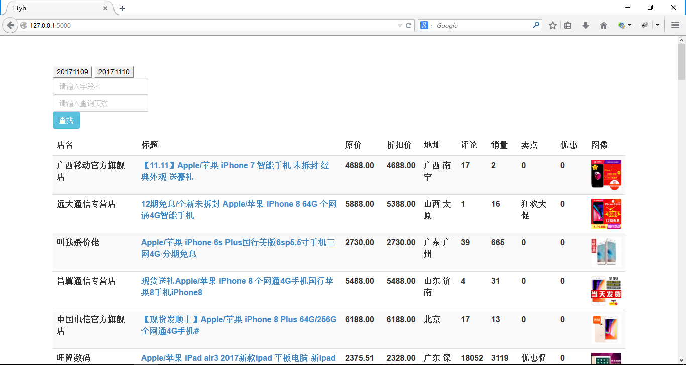

*知己知彼，百战百胜。意为如果对敌我双方的情况都能了解透彻，打起仗来百战就不会有危险。语出《孙子·谋攻篇》：“知彼知己，百战不殆；不知彼而知己，一胜一负；不知彼，不知己，每战必殆。”*

任何一个电子商务公司想要存活下去，必须要时时掌控市场的动态，包括但不局限于：

> 1. 爆款款式
> 2. 热卖销量
> 3. 加个动态
> 4. 竞争对手动态
> 5. 买家购买趋势
> ...

等等...

可以说掌握了市场的动态就相当于掌握了赚钱的渠道，接下来就是强大的运营团队的事情。那么问题来了，如何让运营能够时时把控市场呢？

### 阿里数据产品

可以说 **阿里集团** 为卖家提供了大量的资源，其中包括一项非常重要的资源： `数据` 。但是阿里巴巴的产品种类繁多，且价格不凡，一般的电商公司都会选购这些产品：

> 1. 生意参谋
> 2. 采购排行
> 3. 网销宝
> 4. 订单大管家
> 5. 量子恒道电商分析
> ...

大量的数据产品充实卖家后台，但是这些无非就是一些数据，在大数据时代最值钱的也是数据，阿里的 ** 生意参谋 ** 几乎能满足大部分卖家的后台数据。但是各个运营会发现，** 生意参谋 ** 里面大部分的数据都是卖家自身的数据，对于其他卖家的数据很少，且都通过了变形。什么是变形，就是不展示原始的数据，仅仅提供一个叫做 `淘宝指数` 的值，虽然包含一定的价值，但是在这个统计量上做的分析总会有一些偏差，而真实的数据往往是卖家最需要的。

** 生意参谋 ** 

### 爬虫教程

作者是一个 *爬虫爱好者* ，对于网站的爬虫有一定的心得，因此写了教程 [python爬虫教程](http://www.tybai.com/crawlerfirst/_%E7%88%AC%E8%99%AB%E6%95%99%E7%A8%8B.html)。用 `python` 写一个小型的爬虫不难，仅仅需要几行就可以搞定：

```
#!/usr/bin/env python
# -*- coding: utf-8 -*-

import urllib.request

url = "http://www.tybai.com"
# url = "http://www.baidu.com"

html_bytes = urllib.request.urlopen(url).read()
html = html_bytes.decode("UTF-8")

print(html)
```

为此很多读者对我提出了 **如何抓取淘宝天猫商品** 的需求，毕竟不是每一个读者都能很认真的看完我写的 [python爬虫教程](http://www.tybai.com/crawlerfirst/_%E7%88%AC%E8%99%AB%E6%95%99%E7%A8%8B.html)，而且有些读者是不会编程的，所以我写了一份专门抓取 `淘宝天猫商品` 的爬虫，解决大佬们的问题。

### 淘宝天猫商品抓取

鉴于大部分大佬不会编程，所以做了一个极其简单的网页作为展示：



页面内容包含商品的如下信息：

> 1. 店铺名字
> 2. 商品标题
> 3. 商品原价
> 4. 商品折后价
> 5. 详情页网址
> 6. 评论数
> 7. 销量
> 8. 促销卖点
> 9. 优惠政策
> 10. 商品略缩图
> 11. 商品大图

这些信息在页面可以直接复制到 `excel` 中进行分析：



根据数据可以完成的 **竞品分析** 、**实时价格监控** 、**热卖分析** 、**热词分析** 、**美图** 等等，这些运营会比我清楚，所以不想再列举。

而且页面最重要的还有能自主 `搜索` 、 `抓取商品` 等功能，在页面的左上方可以看到输入框，只需要输入查询关键词和抓取的页数就能实时展现在页面：



但是我想看到以前的商品信息怎么办？保留着信息在本地呢，在页面可以根据 **日期** 对历史的查询信息进行查询：



只要是个卖家就能实时使用这套页面，重点是 **免费** **免费** **免费** ，更加重点的是 **开源** **开源** **开源** ，重要的事说三次！

想要免费下载的可以在如下页面下载 [下载页面](https://github.com/TTyb/tbtmGoods) ，使用方法为，先解压得到如下文件：



双击 `run.bat` 会打开如下页面，当出现 `127.0.0.1:5000` 时：



可以随意在浏览器里面输入网址 [127.0.0.1:5000](127.0.0.1:5000) 就能进入展示页面：



搜索下载一应俱全！但是如果你是稍微懂一点 `python` ，可以在 [淘宝天猫商品抓取分析](http://www.tybai.com/python/%E6%B7%98%E5%AE%9D%E5%A4%A9%E7%8C%AB%E5%95%86%E5%93%81%E6%8A%93%E5%8F%96.html) 里面学习抓取的步骤，可以随意自己更改代码，写出更符合自己公司的代码。

文章欢迎各位转载，但是请注明作者 [TTyb](http://tybai.com) ，出自[淘宝天猫商品抓取](http://www.cnblogs.com/TTyb/p/7816794.html) ，谢谢观赏！